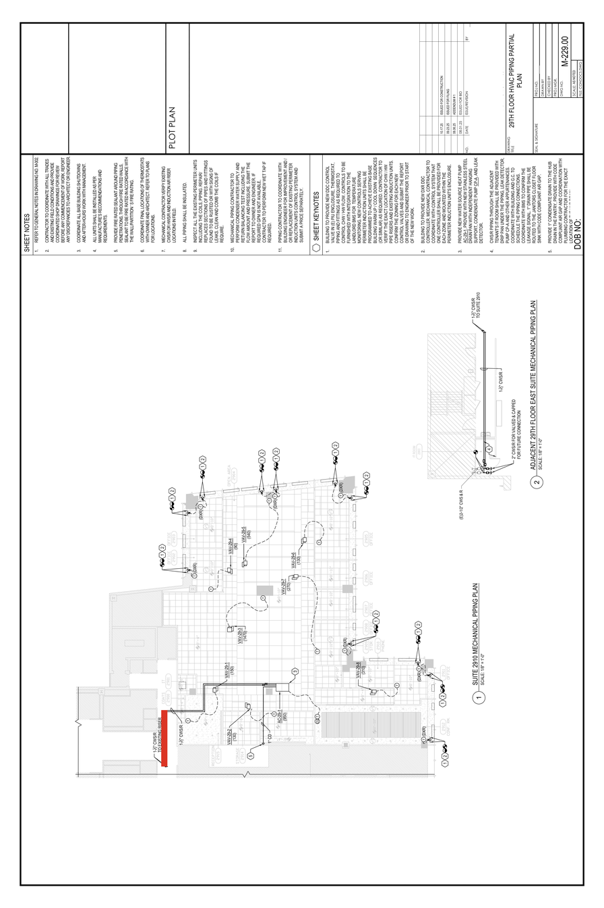

# PDF Measurement Process

## Overview

This document describes the measurement process for converting piping drawings from PDF documents into real-world measurements. The process involves converting a PDF to an optimized image format, identifying pixel coordinates, and performing scale calculations to determine actual dimensions.

**Process Flow:** PDF → Optimized PNG → Pixel Coordinates → Dimension Calculations → Real-World Measurements

---

## Rationale: Why Pre-Process Images?

When LLM APIs ingest PDF files, they perform their own internal processing to create image files for vision capabilities. However, there are critical limitations:

- The exact dimensions of these internally-generated images are **not disclosed**
- Image dimensions are **not readily available** to the LLM during processing
- When prompted, LLMs provide **varying estimates rather than concrete numbers**

**Why this matters:** Knowing the exact dimensions of the image file is critical for accurate measurements.

By sizing images to specification before sending to the API, we can:
- Avoid unpredictable image manipulation by the LLM provider
- Maintain precise control over dimensions for calculations
- Ensure consistency and accuracy

**Reference:** [Anthropic Vision API - Image Size Guidelines](https://platform.openai.com/docs/guides/vision)

> **Note:** A Python script has been created to convert PDFs to high-resolution PNGs and downscale them according to Anthropic's guidelines. This script is shared separately.

---

## Example Walkthrough

This example demonstrates the measurement process using a **24 × 36 inch** piping drawing PDF.

### Step 1: Convert PDF to Optimized Image

Convert the PDF to an LLM-API optimized image file with maximum resolution while maintaining size constraints.

**Source Document:** [piping-red-full.pdf](../pdf/piping-red-full.pdf)

**Output:** Optimized PNG file ready for API processing



---

### Step 2: Identify Pixel Coordinates

Identify the pixel coordinates at the edges of the measurement target (rectangle).

**For this example, the rectangle edges have coordinates:**
```
Point 1: {242, 1051}
Point 2: {242, 1134}
```

---

### Step 3: Calculate Pixel Distance

Calculate the distance between the identified points in pixels.

**Calculation:**
```
1134 - 1051 = 83 pixels
```

---

### Step 4: Convert Pixels to Document Inches

Convert pixel measurements to inches on the full-scale document using the image dimensions.

**Image specifications:**
- Image dimensions: **896 × 1344 px**
- Document dimensions: **24 × 36 inches**

**Conversion factor:**
```
36 inches ÷ 1344 pixels = 0.02679 inches/pixel
```

**Calculation:**
```
83 pixels × 0.02679 inches/pixel = 2.22 inches on the full-scale document
```

---

### Step 5: Convert to Real-World Measurements

Convert the document measurement to real-life dimensions using the drawing scale.

**Drawing scale:** 1/8 inch = 1 foot (i.e., 1 inch = 8 feet)

**Calculation:**
```
2.22 inches × 8 feet/inch = 17.76 feet

Convert decimal feet to inches:
0.76 feet × 12 inches/foot = 9.12 inches ≈ 9 inches (rounded to nearest inch)
```

**Final result:** **17 feet 9 inches**

---

## Results & Validation

| Measurement Method | Result | Difference |
|-------------------|---------|------------|
| Automated Process | 17 ft 9 in | — |
| Real-Life Measurement (marked up file) | 17 ft 7 in | 2 inches |

> **Accuracy Note:** The 2-inch variance is likely due to the imprecise drawing of the red rectangle in the test image, which does not exactly match the original reference dimensions. While there is a 2-inch difference from the actual marked value, the measurement process is accurate to the provided image coordinates and to be used for all evaluations.

---

## Summary

This measurement process provides a systematic approach to extracting real-world dimensions from scaled PDF drawings by:
1. Pre-processing images to known dimensions
2. Identifying precise pixel coordinates
3. Applying scale conversions
4. Validating results against known measurements

The process achieves high accuracy when pixel coordinates are precisely identified.
